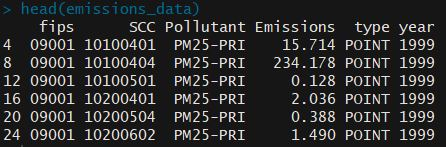

# Air-Emission-Analysis-NEI-United-States

In this project, data is collected from National Emissions Inventory (NEI).
For each year and for each type of PM source, the NEI records how many tons of PM2.5 were emitted from that source over the course of the entire year. The data is for the following years 1999, 2002, 2005, and 2008.

## This repository contains the following files:

* **`README.md`**, this file, which provides an overview of the data set and the R code.
* **`Data/Link To Download Dataset`**,contains two files: 
     - `summarySCC_PM25.rds`: This file contains a data frame with all of the PM2.5 emissions data for 1999, 2002, 2005, and 2008. For each       year, the table contains number of tons of PM2.5 emitted from a specific type of source for the entire year.
     The first few rows of this data:
     
     
     
     **fips** : A five-digit number (represented as a string) indicating the U.S. county  
      **SCC** : The name of the source as indicated by a digit string  
      **Pollutant** : A string indicating the pollutant  
      **Emissions** : Amount of PM2.5 emitted, in tons  
      **type** : The type of source (point, non-point, on-road, or non-road)  
      **year** : The year of emissions recorded  
     
    - `Source_Classification_Code.rds`: This table provides a mapping from the SCC digit strings in the Emissions table to the actual name of the PM2.5 source.
     
* **`R Code`**, contains 6 use cases of R files
1. _`Plot1.R`_ the R script is used to create a plot which depicts have total emissions from PM2.5 decreased in the United States from 1999 to 2008.

2. _`Plot2.R`_ depicsts whether the total emissions from PM2.5 decreased in the Baltimore City from 1999 to 2008

3. _`Plot3.R`_ analyses out of the four types of sources indicated by the **type**(point, nonpoint, onroad, nonroad) variable, which of these four sources have seen decreases in emissions from 1999–2008 for Baltimore City

4. _`Plot4.R`_ analyses across the United States, how have emissions from coal combustion-related sources changed from 1999–2008

5. _`Plot5.R`_ tells us how have emissions from motor vehicle sources changed from 1999–2008 in Baltimore City

6. `Plot6.R`_ compares emissions from motor vehicle sources in Baltimore City and Los Angeles

* **`Images`**, contains the vizualizations made from the _`R`_ code files 
